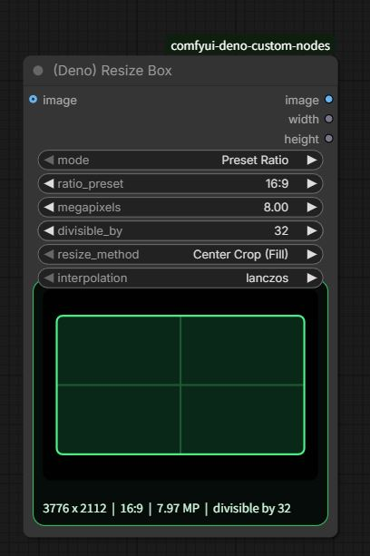
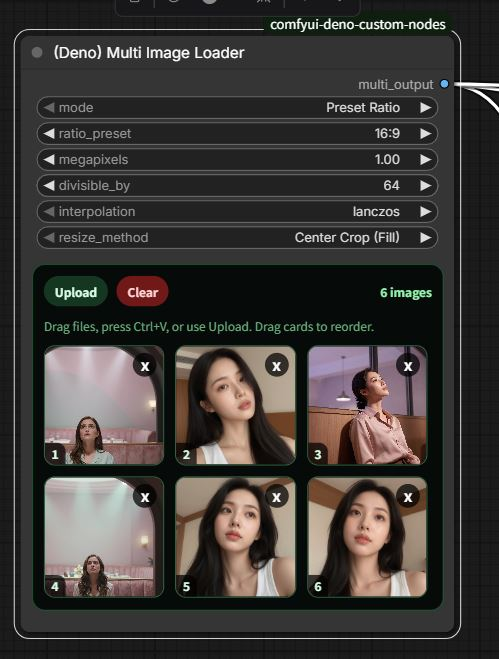
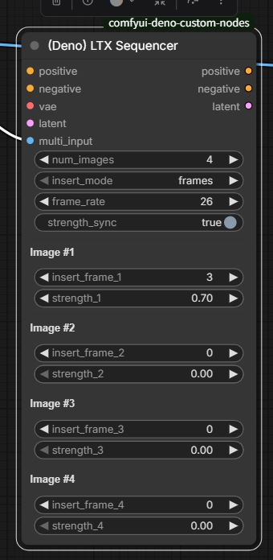

# Deno Custom Nodes

[YouTube Channel](https://www.youtube.com/@Denoise-AI)

Practical ComfyUI custom nodes focused on fast real-world workflow improvements.
This repo is built for global creators and production workflows, with a focus on practical UX and reliable daily use.

## Included Nodes

### `(Deno) Resize Box`

Resolution helper and image resize node for ComfyUI.



Main features:

- `Preset Ratio` and `Manual Input` modes
- common ratio presets
- megapixel-based size calculation
- `divisible_by` alignment
- `Center Crop (Fill)` and `Fit (Letterbox/Pillarbox)` resize modes
- `lanczos` default interpolation
- live ratio preview inside the node
- outputs: `image`, `width`, `height`

### `(Deno) Multi Image Loader`

Minor-upgrade multi-image loader designed for batch guide workflows.

Credit: Inspired by the original workflow ideas from **WhatDreamsCost**, then adapted and refined for the Deno workflow style.



Main features:

- scrollable fixed-height gallery instead of endlessly growing node height
- drag reorder with stable placeholder insertion
- upload button, drag-and-drop upload, and paste image support
- `Preset Ratio` or `Manual Input` size mode
- ratio preset, megapixels, divisible-by sizing, or direct width/height control
- resize method and interpolation selection
- outputs: `multi_output`, `width`, `height`
- optional crop or fit resizing during export

### `(Deno) LTX Sequencer`

LTX guide sequencer tuned for multi-image workflows.

Credit: Inspired by **WhatDreamsCost**'s LTX workflow approach, with Deno-side adjustments focused on day-to-day usability.



Main features:

- works with the batch output from `(Deno) Multi Image Loader`
- auto-fills `num_images` from the connected loader when possible
- keeps the existing sync-style workflow
- allows only `strength` values to break out into manual control when needed

## Why This Exists

These nodes are built to reduce repeated setup friction in actual ComfyUI production work.
The goal is not to chase huge feature lists. The goal is to make the workflows people repeat every day feel faster, cleaner, and easier to teach.

## Search Tips

Try searching with:

- `deno`
- `resize`
- `ltx`
- `(deno)`

## Install

Clone inside your `custom_nodes` folder:

```bash
git clone https://github.com/Deno2026/comfyui-deno-custom-nodes.git
```

Then restart ComfyUI.

## Links

- YouTube: https://www.youtube.com/@Denoise-AI
- GitHub: https://github.com/Deno2026/comfyui-deno-custom-nodes
- Registry: https://registry.comfy.org/publishers/deno2026/nodes/deno-custom-nodes
