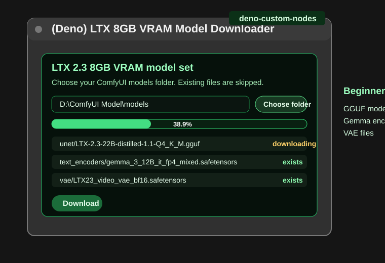

# Deno Custom Nodes

[YouTube Channel](https://www.youtube.com/@Denoise-AI)

Practical ComfyUI custom nodes focused on fast real-world workflow improvements.
This repo is built for global creators and production workflows, with a focus on practical UX and reliable daily use.

## Included Nodes

### `(Deno) Resize Box`

Resolution helper and image resize node for ComfyUI.


Main features:

- `Preset Ratio` and `Manual Input` modes
- common ratio presets
- megapixel-based size calculation
- `divisible_by` alignment
- `Center Crop (Fill)` and `Fit (Letterbox/Pillarbox)` resize modes
- `lanczos` default interpolation
- live ratio preview inside the node
- outputs: `image`, `width`, `height`

### `(Deno) Multi Image Loader`

Minor-upgrade multi-image loader designed for batch guide workflows.

Credit: Inspired by the original workflow ideas from **WhatDreamsCost**, then adapted and refined for the Deno workflow style.


Main features:

- scrollable fixed-height gallery instead of endlessly growing node height
- drag reorder with stable placeholder insertion
- upload button, drag-and-drop upload, and paste image support
- `Preset Ratio` or `Manual Input` size mode
- ratio preset, megapixels, divisible-by sizing, or direct width/height control
- resize method and interpolation selection
- outputs: `multi_output`, `width`, `height`
- optional crop or fit resizing during export

### `(Deno) LTX Sequencer`

LTX guide sequencer tuned for multi-image workflows.

Credit: Inspired by **WhatDreamsCost**'s LTX workflow approach, with Deno-side adjustments focused on day-to-day usability.


Main features:

- works with the batch output from `(Deno) Multi Image Loader`
- auto-fills `num_images` from the connected loader when possible
- keeps the existing sync-style workflow
- allows only `strength` values to break out into manual control when needed

### `(Deno) LTX Model Loader`

One compact loader for the common LTX 2.3 model-loading patterns.


Main features:

- `Checkpoint Style`, `KJ Style`, and `GGUF Style` modes
- outputs: `model`, `clip`, `video_vae`, `audio_vae`
- uses ComfyUI's built-in checkpoint / diffusion / DualCLIP loading paths where possible
- uses KJNodes `VAELoaderKJ` for split video/audio VAE workflows
- uses ComfyUI-GGUF UNet loading for GGUF workflows

### `(Deno) LTX Multi LoRA Loader`

Power-LoRA-style multi LoRA loader for LTX workflows.


Main features:

- add multiple LoRAs in one compact node
- per-slot enable toggle
- per-slot `strength`, `video`, and `audio` strength controls
- outputs patched `model` and `clip`
- designed to stay close to the familiar Power LoRA Loader workflow while adding LTX-friendly A/V controls

### `(Deno) LTX Prompt Guide`

Prompt helper that combines LTX text encoding with frame-rate conditioning and dialogue-length planning.


Main features:

- positive prompt text encoding
- optional collapsible negative prompt
- `frame_rate` conditioning applied to positive and negative outputs
- estimates minimum video length from quoted dialogue
- supports Auto, Korean, English, Japanese, and Chinese dialogue estimates
- outputs: `positive`, `negative`, `frame_rate`

### `(Deno) LTX 8GB VRAM Model Downloader`

Beginner-friendly downloader for the LTX 2.3 GGUF starter model set.



Main features:

- choose your ComfyUI `models` root folder with a Windows folder picker
- downloads files into the correct model subfolders
- skips already-complete files
- resumes `.part` downloads when possible
- shows per-file status and total progress

Downloads:

- `unet/LTX-2.3-22B-distilled-1.1-Q4_K_M.gguf`
- `text_encoders/gemma_3_12B_it_fp4_mixed.safetensors`
- `text_encoders/ltx-2.3_text_projection_bf16.safetensors`
- `vae/LTX23_video_vae_bf16.safetensors`
- `vae/LTX23_audio_vae_bf16.safetensors`
- `latent_upscale_models/ltx-2.3-spatial-upscaler-x2-1.1.safetensors`

## Why This Exists

These nodes are built to reduce repeated setup friction in actual ComfyUI production work.
The goal is not to chase huge feature lists. The goal is to make the workflows people repeat every day feel faster, cleaner, and easier to teach.

## Search Tips

Try searching with:

- `deno`
- `resize`
- `ltx`
- `(deno)`

## Install

Clone inside your `custom_nodes` folder:

```bash
git clone https://github.com/Deno2026/comfyui-deno-custom-nodes.git
```

Then restart ComfyUI.

## Links

- YouTube: https://www.youtube.com/@Denoise-AI
- GitHub: https://github.com/Deno2026/comfyui-deno-custom-nodes
- Registry: https://registry.comfy.org/publishers/deno2026/nodes/deno-custom-nodes
