# Deno Custom Nodes

[YouTube Channel](https://www.youtube.com/@Denoise-AI)

Practical ComfyUI custom nodes focused on fast real-world workflow improvements.
This repo is built for global creators and production workflows, with a focus on practical UX and reliable daily use.

Most Deno nodes include a small green `i` button in the top-right corner for quick node info without leaving the ComfyUI canvas.

## Included Nodes

### `(Deno) Resize Box`

Resolution helper and image resize node for ComfyUI.


Main features:

- `Preset Ratio` and `Manual Input` modes
- common ratio presets
- megapixel-based size calculation
- `divisible_by` alignment
- `Center Crop (Fill)` and `Fit (Letterbox/Pillarbox)` resize modes
- `lanczos` default interpolation
- live ratio preview inside the node
- outputs: `image`, `width`, `height`

### `(Deno) Multi Image Loader`

Minor-upgrade multi-image loader designed for batch guide workflows.

Credit: Inspired by the original workflow ideas from **WhatDreamsCost**, then adapted and refined for the Deno workflow style.

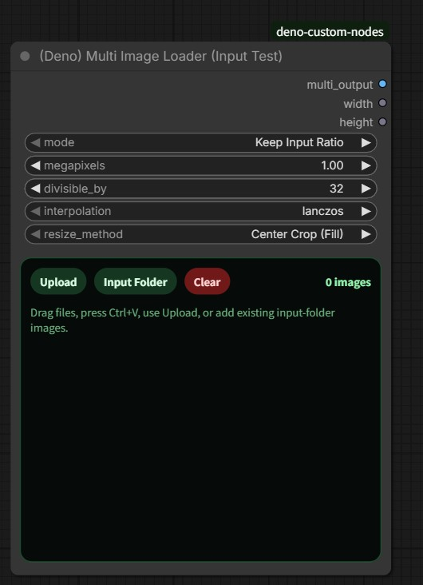

Main features:

- scrollable fixed-height gallery instead of endlessly growing node height
- drag reorder with stable placeholder insertion
- upload button, drag-and-drop upload, and paste image support
- `Input Folder` browser for reusing existing ComfyUI `input` images
- input subfolder browsing with folder tiles, double-click navigation, and a `Parent` button
- nested input images can be added while preserving their ComfyUI subfolder paths
- newest-first input image sorting based on file modified time
- responsive input-folder thumbnails for smoother browsing with many images
- `Keep Input Ratio`, `Preset Ratio`, or `Manual Input` size mode
- ratio preset, megapixels, divisible-by sizing, or direct width/height control
- resize method and interpolation selection
- outputs: `multi_output`, `width`, `height`
- optional crop or fit resizing during export

### `(Deno) Advanced Image Source Loader`

Advanced image source loader for workflows that need external folders, local file paths, web image URLs, and mixed-size image-list output.

This is a separate advanced node. The standard `(Deno) Multi Image Loader` remains the simpler recommended option for normal ComfyUI `input` folder workflows.

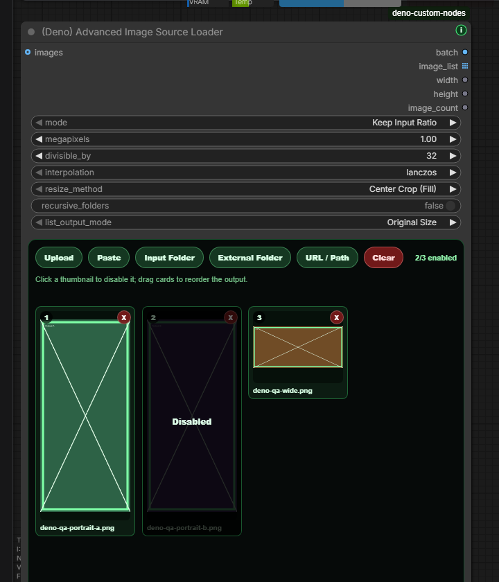

Main features:

- keeps the familiar Deno image-loader gallery workflow
- supports existing ComfyUI `input` folder browsing
- supports external local folder paths outside the ComfyUI `input` folder
- supports folder tiles, nested-folder browsing, and a `Parent` button
- supports `URL / Path` input for web image URLs, absolute local image paths, and local folder paths
- supports upload, drag-and-drop, paste, and browser folder upload where the browser allows it
- `Load Path` reads an external folder directly without first importing it into ComfyUI `input`
- `Upload Folder...` is an optional browser upload/import helper, not required for external path loading
- `recursive_folders` option for loading nested folder images
- `Keep Input Ratio`, `Preset Ratio`, or `Manual Input` size mode
- ratio preset, megapixels, divisible-by sizing, or direct width/height control
- resize method and interpolation selection
- outputs a resized `batch` image tensor for normal batch workflows
- outputs `image_list` for workflows that need per-image list handling
- `Original Size` list mode can preserve mixed source resolutions in `image_list`
- `Match Batch Size` list mode makes `image_list` match the resized batch dimensions
- outputs: `batch`, `image_list`, `width`, `height`, `image_count`

### `(Deno Test) RTX VFX Easy Upscale`

Optional NVIDIA RTX Video Super Resolution helper node for users who want to try NVIDIA VFX inside ComfyUI without manually hunting for the right Python environment.

This node is intentionally separate from the core Deno nodes. It only imports NVIDIA VFX during upscale execution, so normal Deno node installs do not require NVIDIA VFX.

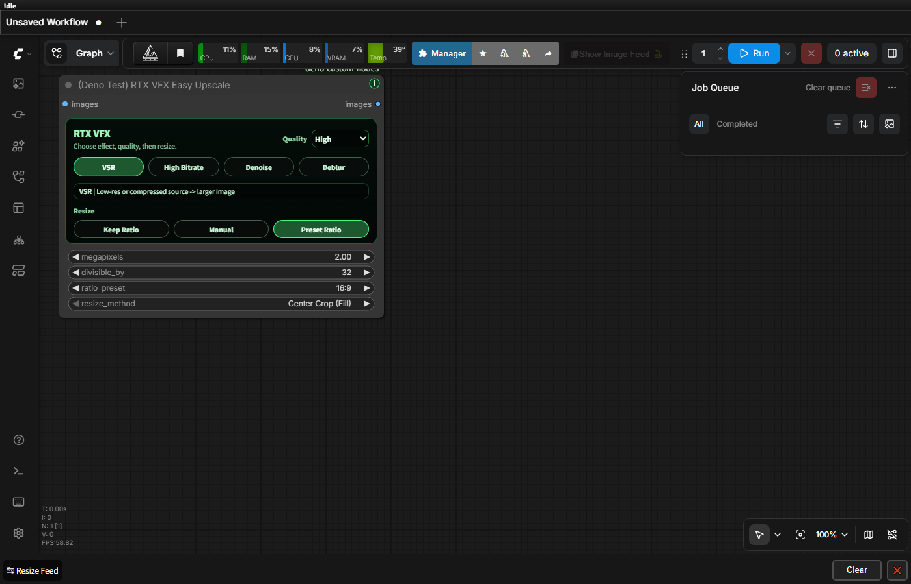

Beginner install flow:

- add `(Deno Test) RTX VFX Easy Upscale`
- run it once with an image
- if NVIDIA VFX is missing, close ComfyUI
- run `tools/install_rtx_vfx.bat`
- restart ComfyUI
- use `(Deno Test) RTX VFX Easy Upscale` again

Mode guide:

| If your image is... | Use |
| --- | --- |
| small, low-res, or compressed | `VSR` |
| already clean, but needs a larger sharper output | `High Bitrate` |
| noisy or grainy | `Denoise` |
| soft, out of focus, or mildly blurred | `Deblur` |

Main features:

- uses NVIDIA's official `nvidia-vfx` / `nvvfx.VideoSuperRes` package
- installer targets the Python used by the current ComfyUI install
- exposes four clear effect buttons for VSR, High Bitrate, Denoise, and Deblur
- shows a compact mode coach line that explains the selected effect in plain language
- keeps Low, Medium, High, and Ultra quality as a separate selector
- for VSR and High Bitrate, supports `Keep Ratio`, `Manual`, and `Preset Ratio` resize choices
- `Keep Ratio` and `Preset Ratio` use target megapixels; `Manual` uses width and height
- exposes `divisible_by` alignment for resizable modes, with `32` as the safe default for NVIDIA VFX output
- does not expose unrestricted `1` alignment in RTX VFX, because arbitrary unaligned sizes can corrupt the NVIDIA VFX result
- shows `Center Crop (Fill)` / `Fit (Letterbox/Pillarbox)` when a manual, preset-ratio, or aligned keep-ratio resize can change aspect ratio
- `Denoise` and `Deblur` keep the original size and hide resize controls
- shows resize controls only when they apply to the selected effect
- Easy Upscale outputs: `images`

For beginner install notes, see `tools/README_RTX_VFX_EASY_INSTALL.md`.

### `(Deno) LTX Sequencer`

LTX guide sequencer tuned for multi-image workflows.

Credit: Inspired by **WhatDreamsCost**'s LTX workflow approach, with Deno-side adjustments focused on day-to-day usability.

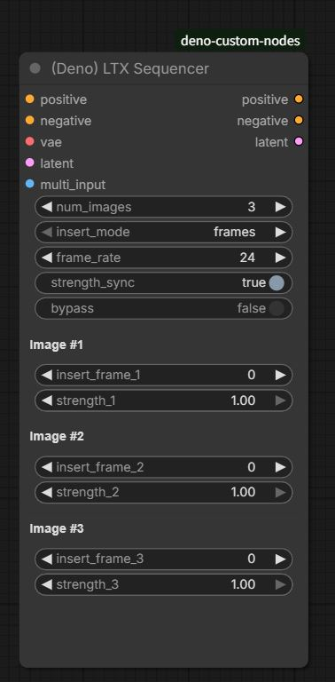

Main features:

- works with the batch output from `(Deno) Multi Image Loader`
- auto-fills `num_images` from the connected loader when possible
- keeps the existing sync-style workflow
- allows only `strength` values to break out into manual control when needed
- `bypass` switch passes `positive`, `negative`, and `latent` through unchanged for quick A/B tests

### `(Deno) LTX Model Loader`

One compact loader for the common LTX 2.3 model-loading patterns.

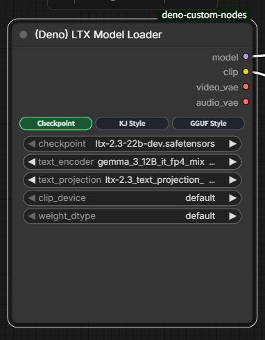

Main features:

- `Checkpoint Style`, `KJ Style`, and `GGUF Style` modes
- outputs: `model`, `clip`, `video_vae`, `audio_vae`
- uses ComfyUI's built-in checkpoint / diffusion / DualCLIP loading paths where possible
- uses KJNodes `VAELoaderKJ` for split video/audio VAE workflows
- uses ComfyUI-GGUF UNet loading for GGUF workflows
- includes clearer dependency errors and an audio VAE compatibility fallback for mixed ComfyUI/KJNodes environments

### `(Deno) Easy Model Download Helper`

Preset-based setup helper for recommended model file sets. The first built-in preset is the LTX 2.3 8GB VRAM GGUF starter set.

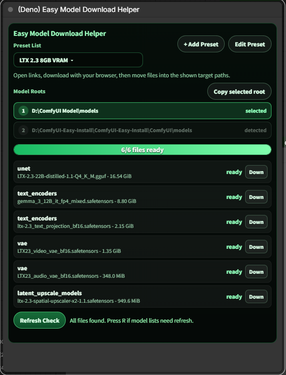

Main features:

- opens official model links in the browser instead of downloading files in Python
- shows detected ComfyUI model roots and lets users copy the selected root
- supports saved creator presets inside the workflow and restores them from browser storage after a page reload
- supports Hugging Face direct links and Civitai page/download links without Python-side network requests
- checks ComfyUI-registered model folders, including custom folder names from `extra_model_paths`
- can find matching files inside model subfolders when users organize large model libraries by project or model family
- shows target ComfyUI model subfolders so viewers know exactly where files should go

Creator preset link guide:

- Hugging Face: right-click the small download icon next to the target file, choose `Copy link address`, then paste that direct file URL into the preset `URL` field.
- Civitai: copy the model page URL from the browser address bar, paste it into the preset `URL` field, then press the `Civitai` button in the editor to convert it to a direct browser download link. If the filename is not visible in the URL, enter the downloaded filename manually.
- For Civitai pages, do not copy the blue `Download` button link unless you intentionally want to provide a direct API download URL.
- `File name` is used only for the target-path check. It should match the downloaded file on disk, especially for Civitai/API links.

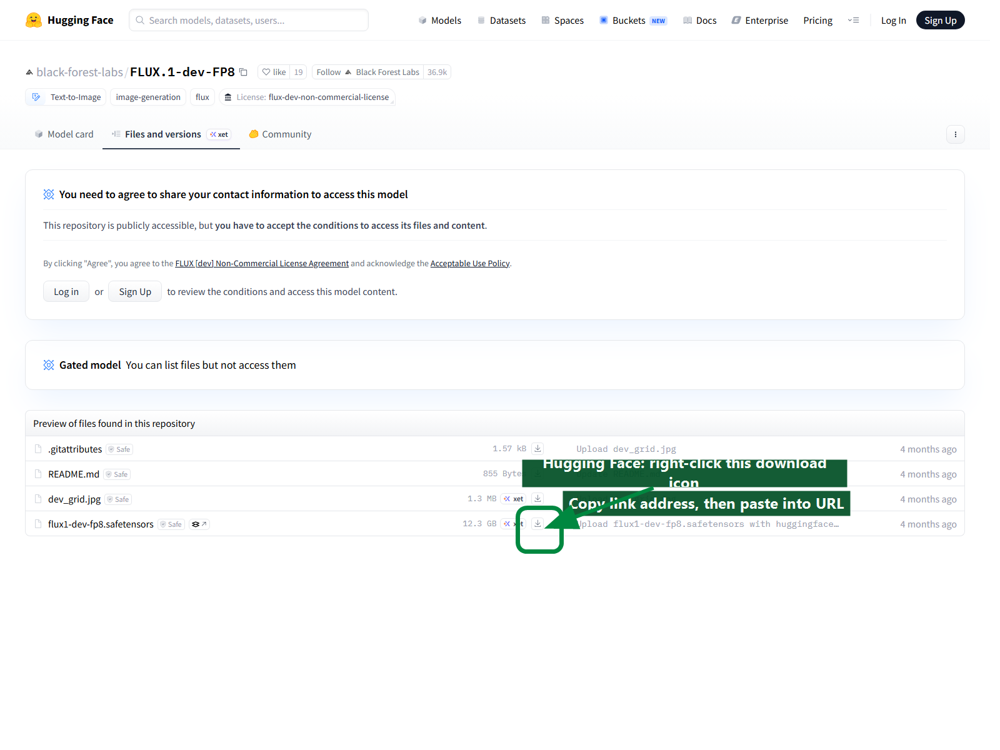

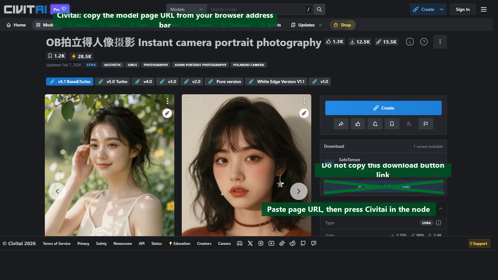

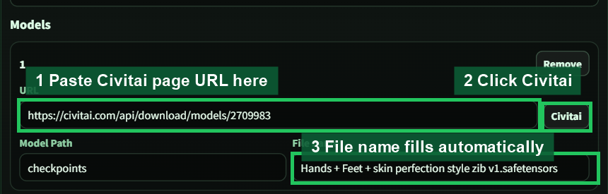

### `(Deno) LTX Multi LoRA Loader`

Power-LoRA-style multi LoRA loader for LTX workflows.

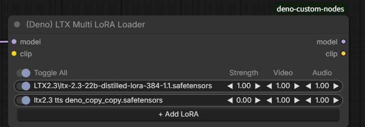

Main features:

- add multiple LoRAs in one compact node
- per-slot enable toggle
- per-slot `strength`, `video`, and `audio` strength controls
- per-slot trigger word and LoRA note editor
- copy saved trigger words from the LoRA row
- outputs patched `model` and `clip`
- designed to stay close to the familiar Power LoRA Loader workflow while adding LTX-friendly A/V controls and lightweight LoRA reference notes

### `(Deno) LTX Prompt Guide`

Prompt helper that combines LTX prompt encoding, optional negative prompt handling, built-in LTX conditioning, and dialogue-length planning.

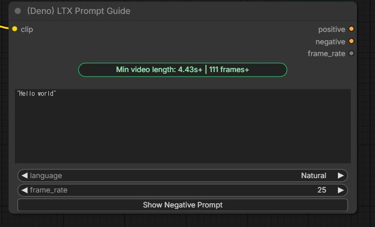

Main features:

- positive prompt text encoding
- optional collapsible negative prompt
- built-in LTX conditioning with `frame_rate`
- estimates minimum video length from quoted dialogue
- supports Auto, Korean, English, Japanese, and Chinese dialogue estimates
- outputs: `positive`, `negative`, `frame_rate`

## Why This Exists

These nodes are built to reduce repeated setup friction in actual ComfyUI production work.
The goal is not to chase huge feature lists. The goal is to make the workflows people repeat every day feel faster, cleaner, and easier to teach.

## Search Tips

Try searching with:

- `deno`
- `resize`
- `ltx`
- `advanced`
- `image source`
- `external folder`
- `(deno)`

## Install

Clone inside your `custom_nodes` folder:

```bash
git clone https://github.com/Deno2026/comfyui-deno-custom-nodes.git
```

Then restart ComfyUI.

## Links

- YouTube: https://www.youtube.com/@Denoise-AI
- GitHub: https://github.com/Deno2026/comfyui-deno-custom-nodes
- Registry: https://registry.comfy.org/publishers/deno2026/nodes/deno-custom-nodes
