# Deno Custom Nodes - Detailed Node Guide

This guide shows the main controls for each Deno node. The goal is to make the node pack easier to understand before users install it or open a workflow.

## `(Deno) Resize Box`

Use this when you need one node for resolution setup, blank image size output, or image resizing.

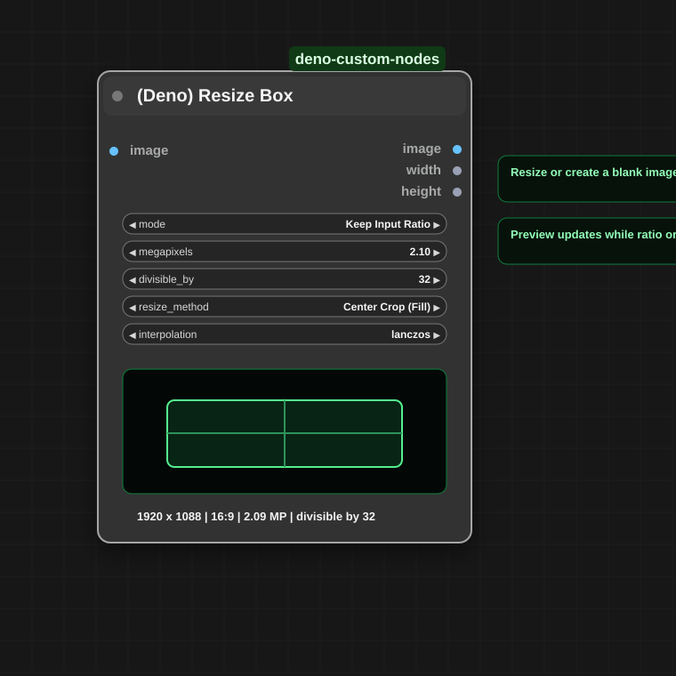

### Size modes

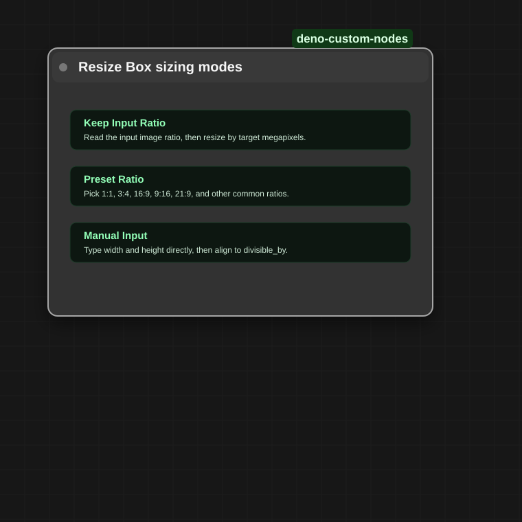

- `Keep Input Ratio`: reads the incoming image aspect ratio and changes only the target size.
- `Preset Ratio`: uses common presets such as `1:1`, `3:4`, `16:9`, `9:16`, and cinematic ratios.
- `Manual Input`: lets you type width and height directly.
- `divisible_by` helps keep sizes aligned to model-friendly values such as `8`, `16`, `32`, or `64`.

## `(Deno) Multi Image Loader`

Use this to build an ordered batch of images and send the batch into guide/sequencer workflows.

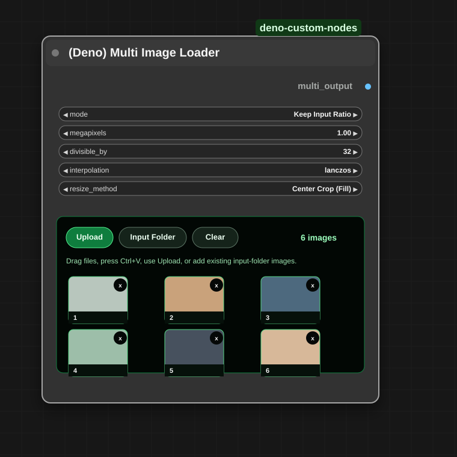

### Input folder browser

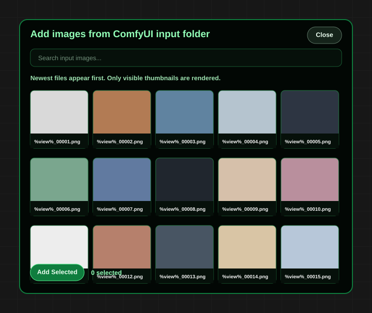

- `Upload`: select new image files.
- `Input Folder`: reuse images already stored in ComfyUI's `input` folder.
- Drag cards to reorder images.
- Paste images with `Ctrl+V`.
- The input-folder browser sorts newest files first and virtualizes thumbnails for smoother browsing.
- Resize settings mirror the practical controls from `(Deno) Resize Box`, without the large preview area.

## `(Deno) LTX Sequencer`

Use this with LTX workflows when you want to insert multiple guide images at specific frames or seconds.

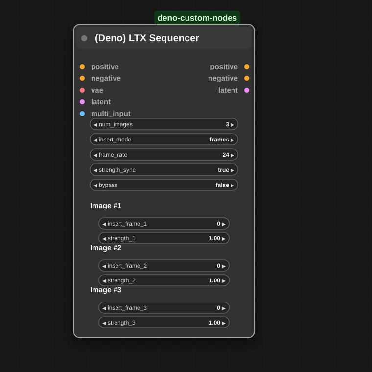

### Sync and bypass behavior

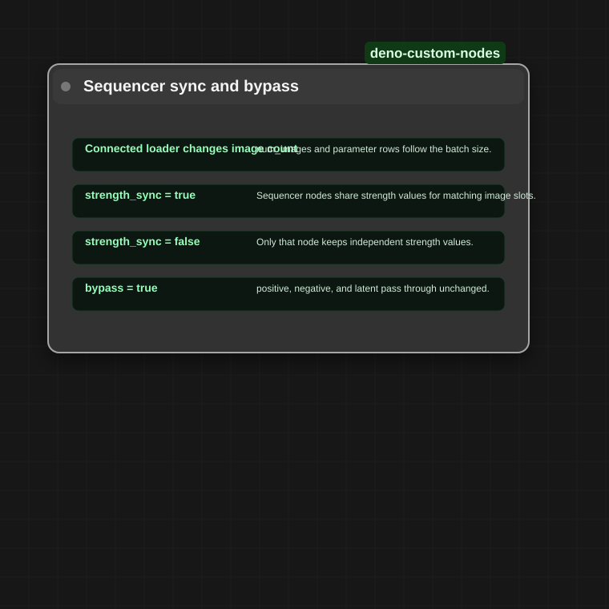

- `num_images` follows the connected multi-image batch when possible.
- `insert_mode` can be `frames` or `seconds`.
- `strength_sync` keeps multiple sequencer nodes aligned unless one node needs independent strength values.
- `bypass` passes `positive`, `negative`, and `latent` through unchanged for quick A/B testing.

## `(Deno) LTX Model Loader`

Use this to reduce several LTX model-loading nodes into one compact helper.

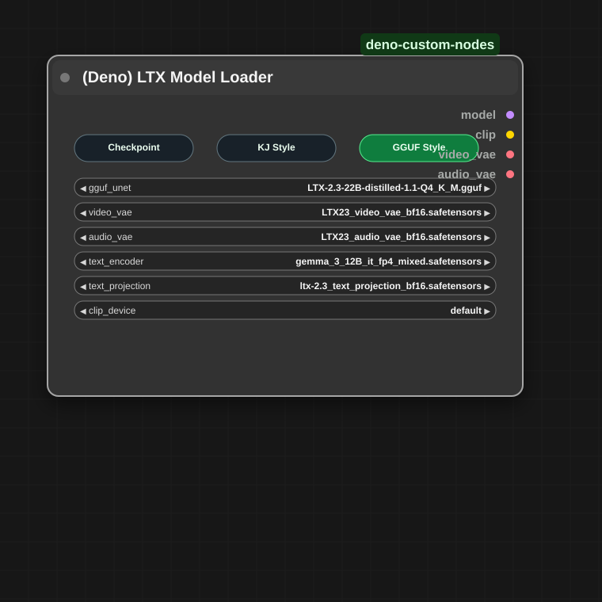

### Loading modes and dependencies

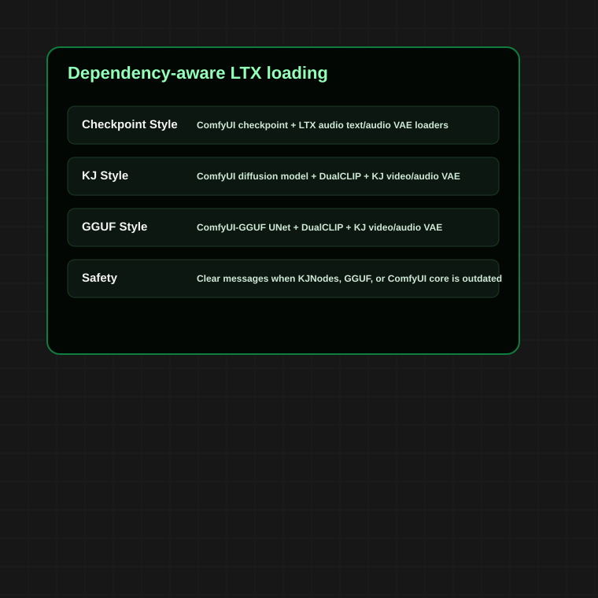

- `Checkpoint Style`: uses ComfyUI checkpoint loading plus LTX audio text/audio VAE loading.
- `KJ Style`: uses diffusion model loading, DualCLIP, and KJNodes VAE loading.
- `GGUF Style`: uses ComfyUI-GGUF for the GGUF UNet and KJNodes for split video/audio VAE loading.
- If required node packs are missing or outdated, the Deno node reports clearer dependency messages.
- The loader includes an audio VAE compatibility fallback for mixed ComfyUI/KJNodes environments.

## `(Deno) Easy Model Download Helper`

Use this when you want viewers to open official model links and place files in the right ComfyUI model folders.

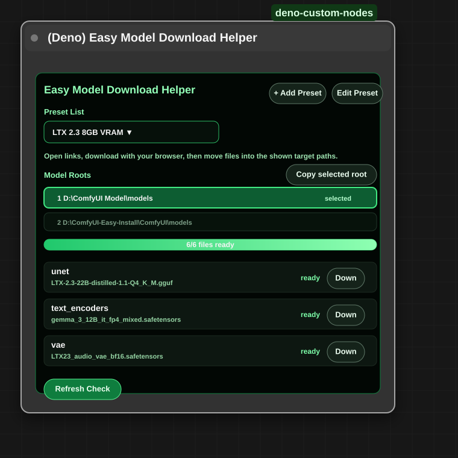

### Creator preset editor

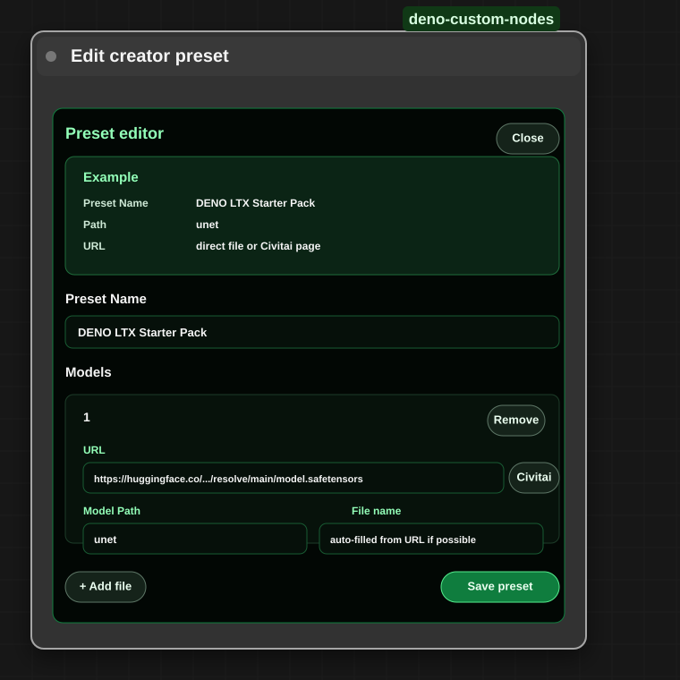

- The built-in preset is `LTX 2.3 8GB VRAM`.
- Creators can add workflow-specific presets and save them into the workflow.
- Users open links with the `Down` button, download with the browser, then move files to the shown target folders.
- The helper does not run Python-side automatic downloads.
- Detected model roots are shown visually so users can see which ComfyUI model folder is being checked.

### Link patterns

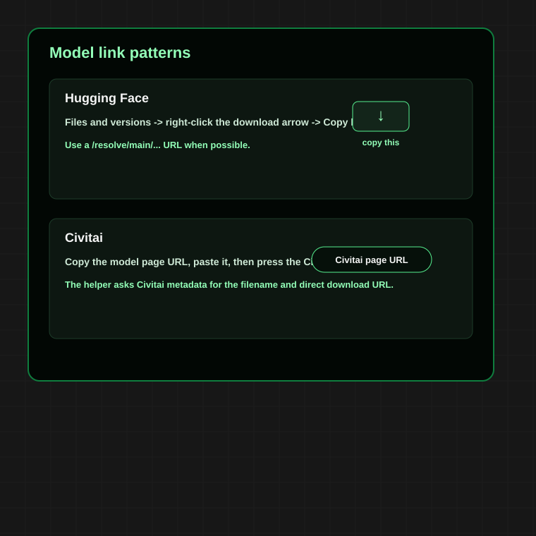

- Hugging Face: use a direct `/resolve/main/...` file URL when possible.
- Civitai: paste the model page URL, then press the `Civitai` button so the helper can resolve metadata.
- `File name` is used for the target path and does not always need to exactly match the visible webpage title.

## `(Deno) LTX Multi LoRA Loader`

Use this to stack multiple LTX LoRAs while keeping the UI close to the familiar Power LoRA Loader flow.

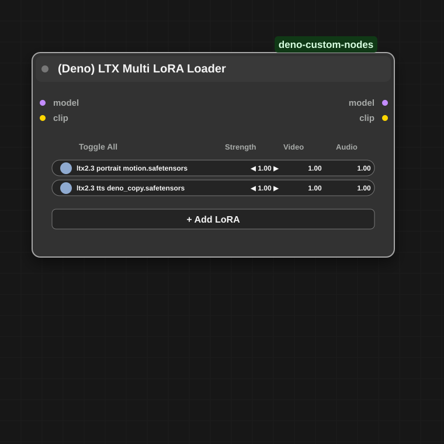

- Add multiple LoRAs in one node.
- Toggle each slot on or off.
- Adjust total `strength`, `video`, and `audio` influence per slot.
- Outputs patched `model` and `clip`.

## `(Deno) LTX Prompt Guide`

Use this to combine LTX prompt encoding, LTX frame-rate conditioning, optional negative prompt handling, and dialogue timing guidance.

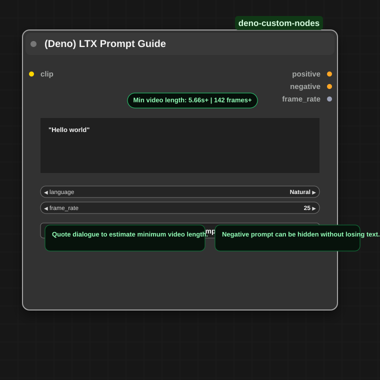

- Quoted text is treated as dialogue for planning.
- The green guide estimates the minimum video length needed for the dialogue only.
- `frame_rate` is output as an integer and is also applied to the conditioning internally.
- The negative prompt can be hidden without losing its stored text.
